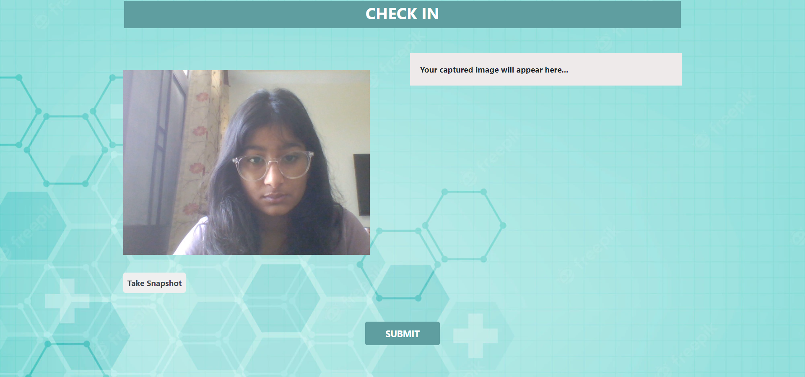
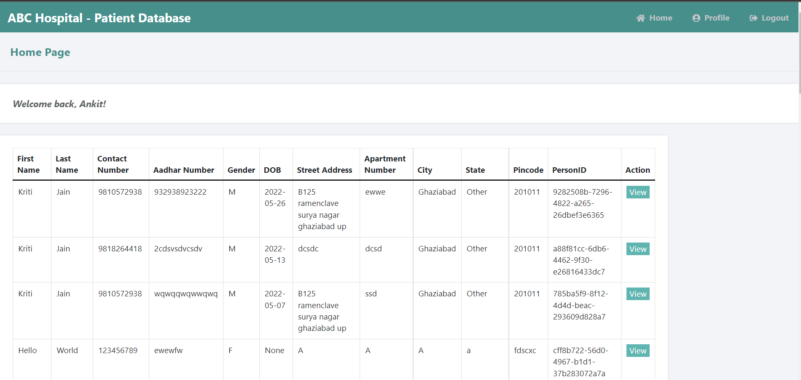

<h1 align="center">Hospital Check-In System </h1>
<h5 align="center"><em>(Using Face Recognition)</em></h5>


## Table of Contents


* [About the Project](#about-the-project)
  * [Built With](#built-with)
* [Getting Started](#getting-started)
  * [Prerequisites](#prerequisites)
  * [Installation](#installation)
  * [Usage](#usage)
* [User Manual](#user-manual)
* [Resources used](#Resources-Used)


## About the Project

This browser-based patient registration application allows patients to upload their details along with their scanned photo while being at their homes. On the patient's arrival at the hospital, only facial recognition is sufficient as registration information is already there in the app database. Face recognition at hospital also ensures that the patient is personally present and so token cab be issued for queuing outside the relevant room.  This little solution can save substantial time at the registration desk, thereby improving the overall efficiency and reduce patient's sufferings. 

There are 3 major features of the application -
1. Patient Registration from home based on personal details, aadhar card and a scanned photo
2. Patient check-in at the hospital using face recognition
3. Hospital administration's option to view the registration data

### Built With

* [Python](https://www.python.org/)
* [Flask](https://palletsprojects.com/p/flask/)
* [Microsoft Azure Face API](https://azure.microsoft.com/en-in/services/cognitive-services/face/#overview)
* [MySQL](https://jquery.com)
## Getting Started

### Prerequisites

* [Python](https://www.python.org/)
* [MySQL Community Server](https://dev.mysql.com/downloads/mysql/)

### Installation

1. Clone the repository
```sh
git clone https://github.com/kritij19/Hospital_CheckIn.git
```
2a. Create a Virtual Environment (Optional)
```sh
python -m venv venv
```
2b. Activate the virtual environment 
```sh
.\venv\Scripts\activate
```
3. Install the requirements and dependancies
```sh
pip install -r requirements.txt
```
4. Run `setup_db.sql` in your MySQL Server  

## Usage

### I) New user registration:

1. Run the following command
```python
python registration\registration.py -u <MySQL_database_user> -p <MySQL_database_password>
```
2. View the application on
```
http://127.0.0.1:5000/
```

### II) Face recognition based CheckIn:
> Note: You will have to stop the execution of one application to access the other. (For windows: Ctrl + C)
1. Run the following command
```python
python face_recognition/face_recognition.py -u <MySQL_database_user> -p <MySQL_database_password>
```
2. View the application on
```
http://127.0.0.1:5000/
```
### III) Hospital Admin Side:
> Note: You will have to stop the execution of one application to access the other. (For windows: Ctrl + C)
1. Run the following command
```python
python hospital_admin/hospital_admin.py -u <MySQL_database_user> -p <MySQL_database_password>
```
2. View the application on
```
http://127.0.0.1:5000/
```

## User Manual

### Module - Patient Registration
1. Fill up the form with personal details, Aadhar card and a scanned photo of the patient. After filling all details, press Submit.


2. On Submit, the application validates if Aadhar number exists in the database, in that case, gives an error message
3. If the Aadhar number does not exists, checks if the photo uploaded is proper, then uses Azue API to create a person id, and stores all relevant details in the database, and shows a success message to the user

### Module - Patient Checkin
1. The patient (usder) to capture his photo using the webcam. Use the Take Snapshot option to click picture



2. Once picture is clicked, it shows on the right hand side, and then click on Submit to compare


3. If the photo captured at the hospital matches with the photo uploaded earlier, then a success message is shown


### Module - Hospital Administration to view Patient Records
1. The hospital administration staff has the option to view patients data. For this, they have to register themselves in the app one time.


2. Once Registration is done, they need to login using the credentials used during registration


3. The administrator can see all patients' data in a tabular format



4. In case they want to view a particular patient's data, then they can click on the view button for that row


## Resources Used

* [Azure Face API](https://docs.microsoft.com/en-us/dotnet/api/overview/azure/cognitiveservices/face-readme?view=azure-dotnet)
* [Integrating MySQL with Flask](https://code.tutsplus.com/tutorials/creating-a-web-app-from-scratch-using-python-flask-and-mysql--cms-22972)
* [Setting up environment variables for data hiding](https://www.twilio.com/blog/environment-variables-python)


